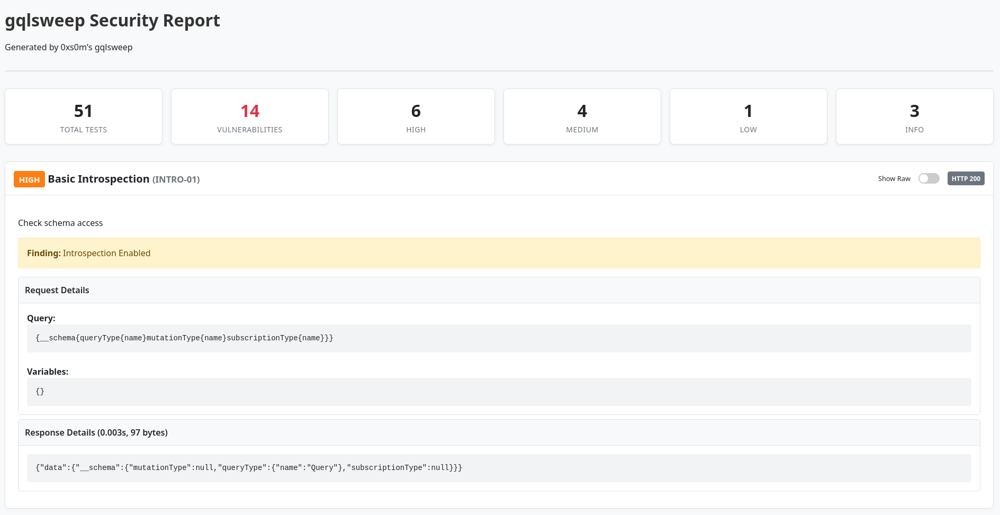

# gqlsweep

A comprehensive, schema-aware security testing tool for GraphQL endpoints. This tool automatically introspects your GraphQL schema and generates dynamic security tests to identify vulnerabilities.

```text
   ____  ____  _     ____                         
  / ___|/ __ \| |   / ___|_      _____  ___ _ __  
 | |  _| |  | | |   \___ \ \ /\ / / _ \/ _ \ '_ \ 
 | |_| | |_| | |___ ___) \ V  V /  __/  __/ |_) | 
  \____|\__\_\_____|____/ \_/\_/ \___|\___| .__/  
                                          |_|     
           by 0xs0m
```

## Features

- **Schema-Aware Testing**: Automatically fetches and parses the GraphQL schema to find real fields and arguments.
- **Dynamic Fuzzing (170+ Test Cases)**:
  - **Introspection**: Deep recursion, hidden fields, and full schema dumps.
  - **Denial of Service (DoS)**: Batching, alias overloading, circular fragments, and deep nesting.
  - **Injection Attacks**: SQLi, NoSQL, Command Injection, LDAP, XXE, XPath, and GraphQL-specific injections.
  - **Authorization**: BOLA/IDOR, tenant isolation bypass, privilege escalation, and mass assignment.
  - **Information Disclosure**: Stack traces, debug modes, internal types, and sensitive fields.
  - **XSS**: Reflected, stored, and polyglot payloads.
  - **SSRF**: Cloud metadata probes (AWS, GCP, Azure), internal port scanning, and file protocol abuse.
  - **CSRF**: Origin/Referer validation stripping.
  - **Business Logic**: Negative limits, price manipulation, and quantity tampering.
  - **Cryptography**: Weak JWT algorithms (None), token expiration, and weak secrets.
  - **File Handling**: Malicious filenames, path traversal, and zip bombs.
  - **Relay Patterns**: Node ID decoding and edge manipulation.
- **Universal Compatibility**: Works with any GraphQL endpoint (Apollo, Hasura, Graphene, etc.).
- **Robust Parsing**: Handles complex `curl` commands with custom headers, cookies, and proxy settings.
- **Multiple Report Formats**:
  - **JSON**: For programmatic processing.
  - **HTML**: For easy human review.
  
    
  - **Burp Suite XML**: For importing findings into Burp Suite.
  - **Verbose Mode**: Print raw HTTP responses for debugging.
- **Zero Dependencies**: Written in pure Python 3 using standard libraries. No `pip install` needed!

## Installation

Just download the script. It requires Python 3.6+.

```bash
git clone https://github.com/Somchandra17/gqlsweep.git
cd gqlsweep
chmod +x gqlsweep.py
```

## Docker Support

You can also run the tool using Docker:

1. **Build the image**:

    ```bash
    docker build -t gqlsweep .
    ```

2. **Run a scan** (output to console):

    ```bash
    docker run --rm gqlsweep -r request.curl -v
    ```

3. **Run with reports** (mount the current directory to save output):

    ```bash
    docker run --rm -v $(pwd):/app/reports gqlsweep -r request.curl -o /app/reports/results.json
    ```

## Usage

You can run the tool by passing a raw `curl` command or a file containing one.

### Basic Usage

```bash
# Pass a curl command directly
python3 gqlsweep.py -c "curl https://api.example.com/graphql -H 'Authorization: Bearer 123' --data 'query { me { name } }'"
```

### Advanced Usage

1. **Capture a Request**: Copy a GraphQL request from your browser network tab or Burp Suite as a cURL command.
2. **Save to File** (Optional but recommended for long commands):

    ```bash
    echo "curl 'https://api.target.com/graphql' ..." > request.curl
    ```

3. **Run the Scanner**:

    ```bash
    python3 gqlsweep.py -r request.curl -o findings.json --html report.html -v
    ```

### Command Line Arguments

| Argument | Description |
| :--- | :--- |
| `-c`, `--curl` | The full curl command string (wrap in single quotes). |
| `-r`, `--request-file` | Path to a file containing the curl command. |
| `-o`, `--output` | Path to save the JSON results file. |
| `--html` | Path to save the HTML report. |
| `--xml` | Path to save the Burp Suite XML report. |
| `-v`, `--verbose` | Enable verbose mode to print raw responses. |
| `-x`, `--proxy` | Proxy URL (overrides curl proxy) e.g. `http://127.0.0.1:8080` |
| `-h`, `--help` | Show the help message. |

### Using with a Proxy (Burp Suite/Zap)

You can specify a proxy using the `--proxy` / `-x` flag, which overrides any proxy set in the curl command.

```bash
# Verify traffic through Burp
python3 gqlsweep.py -r request.curl --proxy http://127.0.0.1:8080
```

## Disclaimer

This tool is for **educational and authorized security testing purposes only**. Do not use this tool on systems you do not own or have explicit permission to test. The authors are not responsible for any misuse or damage caused by this tool.

## Detailed Test Case Reference

### 1. INTROSPECTION TESTS (Information Disclosure)

| ID | Test Name | Description | Query Pattern |
|---|---|---|---|
| INTRO-01 | Basic Introspection | Check if basic schema introspection is enabled | `{__schema{queryType{name}...}}` |
| INTRO-02 | Full Schema Dump | Attempt to dump entire GraphQL schema | Complex introspection query |
| INTRO-03 | Alternative Introspection | Test non-standard introspection fields | `{schema{queryType{name}...}}` |
| INTRO-04 | Deep Nested Introspection | Test deep recursion (CVE-2024-40094) | `{__schema{types{fields{...}}}}` |
| INTRO-05 | Field Suggestion Probing | Force errors to get field suggestions | Query with non-existent fields |
| INTRO-06 | Type Name Introspection | Get all type names | `{__schema{types{name kind}}}` |
| INTRO-07 | Directive Introspection | List all available directives | `{__schema{directives{...}}}` |
| INTRO-08 | Mutation Introspection | Get all mutation fields | `{__schema{mutationType{...}}}` |
| INTRO-09 | Subscription Introspection | Get all subscription fields | `{__schema{subscriptionType{...}}}` |
| INTRO-10 | Enum Value Extraction | Extract all enum values | `{__schema{types{enumValues{...}}}}` |

### 2. DENIAL OF SERVICE (DoS) TESTS

| ID | Test Name | Description | Query Pattern |
|---|---|---|---|
| DOS-01 | Query Batching (2 queries) | Test if multiple queries allowed | `[{query1}, {query2}]` |
| DOS-02 | Mass Query Batching | Overwhelm server with 50+ batched queries | Array of 50+ queries |
| DOS-03 | Alias Overloading | Resource exhaustion via 100+ aliases | `{a1:field a2:field ...}` |
| DOS-04 | Field Duplication | Duplicate same field 100+ times | `{field{dup dup dup...}}` |
| DOS-05 | Deep Recursion | Stack overflow via deep nesting (20+ levels) | `field{sub{sub{...}}}` |
| DOS-06 | Circular Fragment | Infinite loop in fragment resolution | `fragment A { ...B } fragment B { ...A }` |
| DOS-07 | Resource Intensive | Request maximum possible data | Expand all fields |
| DOS-08 | Pagination Limit Bypass | Request excessive records | `limit: 999999` |
| DOS-09 | Negative Offset/Limit | Test negative pagination values | `limit: -1` |
| DOS-10 | Null Byte Injection | Inject null bytes in query | `\x00` in strings |
| DOS-11 | Large Integer Values | Test max int values | `id: 999999999999` |
| DOS-12 | Array Size Abuse | Pass huge arrays in variables | `ids: [1...10000]` |
| DOS-13 | Complex Variables | Deeply nested JSON variables | `{"a":{"b":...}}` |
| DOS-14 | Multiple Operations | Query + Mutation + Subscription | Mixed operations |
| DOS-15 | Comment Abuse | Excessive comments | 1000+ comment lines |
| DOS-16 | Whitespace Abuse | Excessive whitespace | 10KB+ whitespace |
| DOS-17 | Unicode Abuse | Unicode/Emoji characters | `id: "🚀"` |
| DOS-18 | Repeated Variables | Same variable defined multiple times | `$id: ID, $id: String` |
| DOS-19 | Fragment Spread Abuse | Spread fragment 100+ times | `{...A ...A ...A}` |
| DOS-20 | Inline Fragment Abuse | Multiple inline fragments | `{... on T {...} ... on T {...}}` |

### 3. INJECTION ATTACK TESTS

**SQL Injection**

| ID | Payload Example |
|---|---|
| INJ-SQL-01 | `' OR '1'='1` |
| INJ-SQL-02 | `' UNION SELECT null,null--` |
| INJ-SQL-03 | `' AND (SELECT SLEEP(5))--` |
| INJ-SQL-04 | `' AND 1=CONVERT(int, @@version)--` |
| INJ-SQL-05 | `' AND 1=1--` |
| INJ-SQL-06 | `'; DROP TABLE users;--` |
| INJ-SQL-07 | `/**/OR/**/1=1` |
| INJ-SQL-08 | `%27%20OR%201=1` |
| INJ-SQL-09 | Second-Order Store/Trigger |
| INJ-SQL-10 | `{"id": {"$raw": "' OR 1=1"}}` |

**NoSQL Injection**

| ID | Payload Example |
|---|---|
| INJ-NOSQL-01 | `{"$ne": null}` |
| INJ-NOSQL-02 | `{"$gt": ""}` |
| INJ-NOSQL-03 | `{"$regex": ".*"}` |
| INJ-NOSQL-04 | `"this.password.length > 0"` |
| INJ-NOSQL-05 | MapReduce Injection |
| INJ-NOSQL-06 | `{"$where": "sleep(5000)"}` |
| INJ-NOSQL-07 | `{"$elemMatch": {"$gt": ""}}` |
| INJ-NOSQL-08 | `{"$nin": ["invalid"]}` |

**Command Injection**

| ID | Payload Example |
|---|---|
| INJ-CMD-01 | `; whoami` |
| INJ-CMD-02 | `` `whoami` `` |
| INJ-CMD-03 | `$(whoami)` |
| INJ-CMD-04 | `| cat /etc/passwd` |
| INJ-CMD-05 | `\n/bin/sh\n` |
| INJ-CMD-06 | Base64 Encoded Command |
| INJ-CMD-07 | `; sleep 5` |
| INJ-CMD-08 | `; ping attacker.com` |

**LDAP / XXE / XPath / GraphQL Injection**

| ID | Category | Payload/Desc |
|---|---|---|
| INJ-LDAP-01 | LDAP | `*)(uid=*))(&(uid=*` |
| INJ-LDAP-02 | LDAP | `admin)(password=*)` |
| INJ-LDAP-03 | LDAP | `admin)(objectClass=*` |
| INJ-XXE-01 | XXE | `<!ENTITY xxe SYSTEM "file:///etc/passwd">` |
| INJ-XXE-02 | XXE | Remote DTD fetch |
| INJ-XXE-03 | XXE | Blind OOB |
| INJ-XXE-04 | XXE | Error-based |
| INJ-XPATH-01 | XPath | `' or '1'='1` |
| INJ-XPATH-02 | XPath | `'] //* ['` |
| INJ-GQL-01 | GraphQL | Variable Injection |
| INJ-GQL-02 | GraphQL | Directive Injection (`@skip`) |
| INJ-GQL-03 | GraphQL | Fragment Injection |
| INJ-GQL-04 | GraphQL | Operation Name Injection |
| INJ-GQL-05 | GraphQL | Alias Injection |

### 4. AUTHORIZATION & ACCESS CONTROL (BOLA/IDOR)

| ID | Test Name | Description |
|---|---|---|
| AUTH-01 | IDOR - Sequential ID | Increment/Decrement IDs (123 -> 124) |
| AUTH-02 | IDOR - UUID Enum | Modify UUID segments |
| AUTH-03 | IDOR - Bulk ID | Request `ids: ["1", "2"]` |
| AUTH-04 | IDOR - Null/Empty | `id: null` or `id: ""` |
| AUTH-05 | Tenant Bypass | Modify tenant headers |
| AUTH-06 | Cross-User Access | Change user context variables |
| AUTH-07 | Privilege Escalation | Attempt admin mutations |
| AUTH-08 | Horizontal Privilege | Access same-role data |
| AUTH-09 | Vertical Privilege | Access higher-role data |
| AUTH-10 | Function Level Access | Use disabled features |
| AUTH-11 | Field-Level Access | Query restricted fields |
| AUTH-12 | Object Property Bypass | Query `__typename`, internal fields |
| AUTH-13 | Mass Assignment | Update readonly fields |
| AUTH-14 | Insecure Direct Object | Use email instead of ID |
| AUTH-15 | Archive Access | Access `status: "archived"` |

### 5. INFORMATION DISCLOSURE

| ID | Description |
|---|---|
| INFO-01 | Stack Trace Exposure |
| INFO-02 | Debug Information (`__debug`) |
| INFO-03 | Internal IP Disclosure |
| INFO-04 | Path Disclosure |
| INFO-05 | Version Information |
| INFO-06 | Database Schema Leak |
| INFO-07 | Sensitive Field Enumeration (password, secret) |
| INFO-08 | Error Message Fingerprinting |
| INFO-09 | Extension Data Leak |
| INFO-10 | Suggestion Enumeration ("Did you mean...") |
| INFO-11 | Timing Analysis |
| INFO-12 | Verbose Errors |
| INFO-13 | Internal Types (`__Internal`) |
| INFO-14 | Deprecation Information |
| INFO-15 | Description Harvesting |

### 6. XSS TESTS

| ID | Payload |
|---|---|
| XSS-01 | `<script>alert(1)</script>` |
| XSS-02 | `` |
| XSS-03 | `<svg onload=alert(1)>` |
| XSS-04 | `javascript:alert(1)` |
| XSS-05 | `" onfocus=alert(1) autofocus="` |
| XSS-06 | `${alert(1)}` |
| XSS-07 | `&lt;script&gt;` |
| XSS-08 | Unicode Escapes |
| XSS-09 | Polyglot Payload |
| XSS-10 | Stored XSS |

### 7. SSRF TESTS

| ID | Target |
|---|---|
| SSRF-01 | AWS Metadata (`169.254.169.254`) |
| SSRF-02 | GCP Metadata |
| SSRF-03 | Azure Metadata |
| SSRF-04 | Kubernetes API |
| SSRF-05 | Docker Sock |
| SSRF-06 | Localhost (`127.0.0.1`) |
| SSRF-07 | Internal Network (`192.168.x.x`) |
| SSRF-08 | File Protocol (`file:///`) |
| SSRF-09 | Gopher Protocol |
| SSRF-10 | FTP Protocol |
| SSRF-11 | DNS Rebinding |
| SSRF-12 | Cloud Headers |
| SSRF-13 | Redirect Chains |
| SSRF-14 | IPv6 Bypass |
| SSRF-15 | Decimal IP |

### 8. CROSS-SITE REQUEST FORGERY (CSRF) TESTS

| ID | Test Name | Description |
|---|---|---|
| CSRF-01 | Origin Header Removal | Remove Origin header |
| CSRF-02 | Origin Header Modification | Change Origin to evil.com |
| CSRF-03 | Referer Header Removal | Remove Referer |
| CSRF-04 | Referer Header Spoofing | Fake referer |
| CSRF-05 | Content-Type Change | Change to text/plain |
| CSRF-06 | X-Requested-With Removal | Remove AJAX header |
| CSRF-07 | Custom Header Removal | Remove custom auth headers |
| CSRF-08 | GET Request Conversion | Convert POST to GET |
| CSRF-09 | Simple Request Bypass | Use simple CORS request |
| CSRF-10 | Preflight Bypass | Avoid preflight checks |

### 9. BUSINESS LOGIC & VALIDATION TESTS

| ID | Test Name | Description |
|---|---|---|
| LOGIC-01 | Negative Pricing | Pass negative amounts |
| LOGIC-02 | Price Manipulation | Modify prices in mutations |
| LOGIC-03 | Quantity Tampering | Excessive quantities |
| LOGIC-04 | Race Condition | Simultaneous requests |
| LOGIC-05 | State Machine Bypass | Invalid state transitions |
| LOGIC-06 | Workflow Bypass | Skip required steps |
| LOGIC-07 | Rate Limit Bypass | Distributed requests |
| LOGIC-08 | Time-Based Logic | Modify timestamps |
| LOGIC-09 | Currency Manipulation | Change currency codes |
| LOGIC-10 | Discount Abuse | Apply multiple discounts |
| LOGIC-11 | Refund Abuse | Excessive refunds |
| LOGIC-12 | Inventory Bypass | Negative stock, oversell |

### 10. CRYPTOGRAPHY & TOKEN TESTS

| ID | Test Name | Description |
|---|---|---|
| CRYPTO-01 | JWT None Algorithm | alg: "none" |
| CRYPTO-02 | JWT Weak Secret | Brute force weak signing |
| CRYPTO-03 | JWT Algorithm Confusion | RS256 to HS256 |
| CRYPTO-04 | Token Expiration Bypass | Use expired tokens |
| CRYPTO-05 | Token Replay | Reuse old tokens |
| CRYPTO-06 | Token Structure Tampering | Modify payload |
| CRYPTO-07 | Session Fixation | Fixate session IDs |
| CRYPTO-08 | Weak Randomness | Predictable tokens |
| CRYPTO-09 | Sensitive Data in Token | Decode JWT payload |
| CRYPTO-10 | Token Scope Escalation | Modify scope/permissions |

### 11. FILE UPLOAD & HANDLING TESTS

| ID | Test Name | Payload |
|---|---|---|
| FILE-01 | Malicious Filename | ../../../etc/passwd |
| FILE-02 | Null Byte Injection | file.jpg%00.php |
| FILE-03 | Double Extension | file.php.jpg |
| FILE-04 | Content-Type Spoofing | image/php |
| FILE-05 | SVG XSS | SVG with embedded script |
| FILE-06 | XML Bomb | Billion laughs attack |
| FILE-07 | Zip Bomb | Compressed bomb |
| FILE-08 | Path Traversal | ..%2F..%2Fetc%2Fpasswd |
| FILE-09 | Size Abuse | Extremely large files |
| FILE-10 | Metadata Injection | EXIF data injection |

### 12. RELAY/CONNECTION PATTERN TESTS (Relay-specific)

| ID | Test Name | Description |
|---|---|---|
| RELAY-01 | Node ID Decoding | Decode base64 node IDs |
| RELAY-02 | Edge Manipulation | Modify edge cursors |
| RELAY-03 | Connection Pagination | Abuse first/after |
| RELAY-04 | Global ID Spoofing | Create fake global IDs |
| RELAY-05 | Interface Fragments | Fragment on interface |
| RELAY-06 | Union Type Abuse | Query all union types |
| RELAY-07 | Cursor Prediction | Predict next cursors |
| RELAY-08 | Backward Pagination | Abuse last/before |

### Summary

| Category | Count | Severity Range |
|---|---|---|
| Introspection | 10 | INFO to HIGH |
| Denial of Service | 20 | MEDIUM to CRITICAL |
| Injection (all types) | 35 | HIGH to CRITICAL |
| Authorization | 15 | HIGH to CRITICAL |
| Information Disclosure | 15 | LOW to HIGH |
| XSS | 10 | MEDIUM to HIGH |
| SSRF | 15 | HIGH to CRITICAL |
| CSRF | 10 | MEDIUM to HIGH |
| Business Logic | 12 | MEDIUM to CRITICAL |
| Cryptography | 10 | HIGH to CRITICAL |
| File Handling | 10 | MEDIUM to CRITICAL |
| Relay Patterns | 8 | MEDIUM to HIGH |
| **Total** | **170+** | **INFO to CRITICAL** |

*(Full list includes 170+ specific test IDs as implemented in the source code.)*
